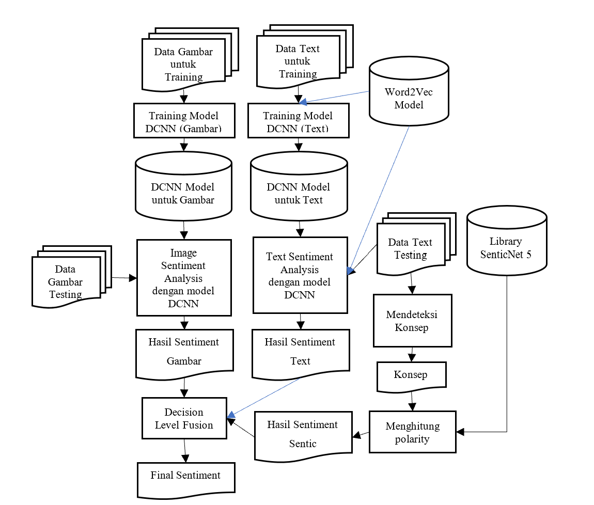
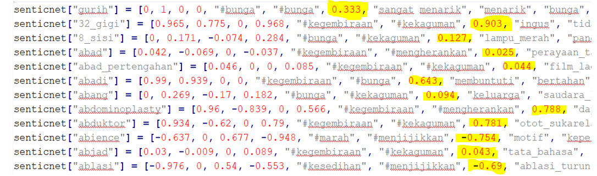
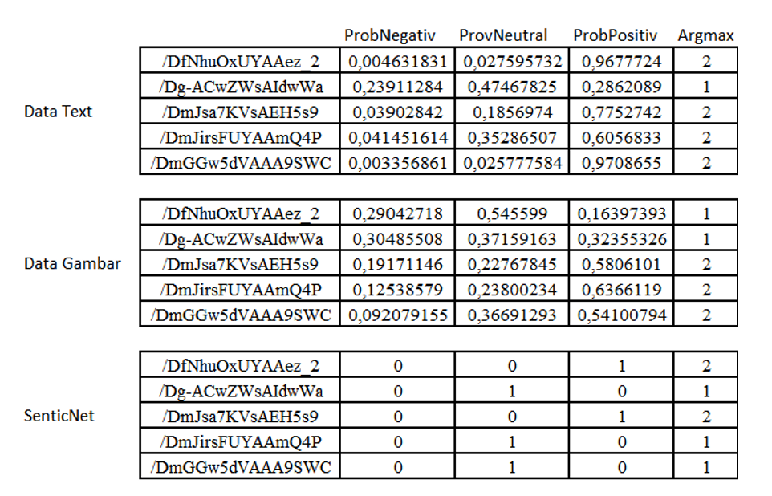
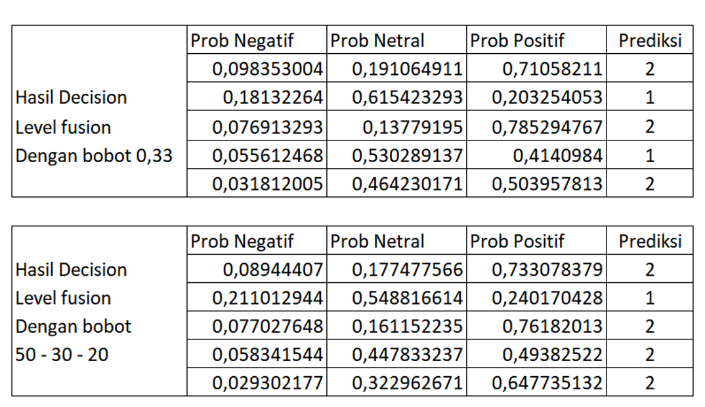

# Multimodal Sentiment Analysis

# Daftar Isi
- [Arsitektur Sistem](#arsitektur-sistem)
- [Mendeteksi konsep untuk SenticNet](#mendeteksi-konsep-untuk-senticnet)
- [Menghitung Polarity](#menghitung-polarity)
- [Decision Level Fusion](#decision-level-fusion)

# Arsitektur Sistem



Pada proses Multimodal sentiment analysis dilakukan penggabungan dari 2 modality yaitu text dan gambar. Proses dilakukan menggunakan model convolutional neural network yang telah dilatih sebelumnya. Terdapat 2 proses sentiment analysis atau pengujian model yang telah dilatih yaitu image sentiment analysis dan text sentiment analysis serta 1 proses perhitungan nilai polarity dengan menggunakan SenticNet 5. Alur proses pada multimodal sentiment analysis dapat dilihat pada Gambar di atas.

Masing-masing modality menggunakan model deep convolution neural network tersendiri yang telah dilatih terlebih dahulu dengan data training. Pada modality text ditambahkan proses mendeteksi konsep dan menghitung polarity dengan menggunakan SenticNet 5. Hasil sentiment dari setiap modality dan sentic digabungkan dengan menggunakan decision level fusion dengan bobot 0,33 untuk setiap modality atau equal-weighted scheme.

# Mendeteksi Konsep untuk SenticNet
Proses mendeteksi konsep dilakukan dengan melakukan pencarian konsep pada kalimat berdasarkan database dari SenticNet 5. Setiap kata pada suatu kalimat dianggap menjadi konsep yang berdisi sendiri dengan melakukan proses tokenisasi, yaitu memberi id atau token pada setiap kata. Setiap konsep dimasukkan atau di cek pada library SenticNet 5, jika konsep tersebut ditemukan pada library SentiNet 5 maka diperoleh nilai dari konsep tersebut dan apabila konsep tersebut tidak terdapat dalam SenticNet 5 maka nilai polarity adalah 0. 

Setiap nilai konsep yang didapatkan digunakan untuk menghitung polarity score berdasarkan database SenticNet 5.  Pada Gambar di bawah berisikan contoh konsep yang terdapat pada database SenticNet 5 dengan warna kuning sebagai nilai polarity untuk setiap konsep. Proses mendeteksi konsep dilakukan dengan program python sederhana.



Proses yang dilakukan untuk mendeteksi konsep dijelaskan dalam bentuk algoritma pada algoritma di bawah ini. Pada baris 1 library senticnet dibaca terlebih dahulu. Pada baris 2 seluruh kalimat yang telah dikumpulkan pada file text dibaca oleh program. Setiap kata dilakukan tokenisasi pada baris 3. Pada baris 4 hanya melakukan deklarasi variable yang menyimpan nilai hasil yang telah ditemukan dalam library. Pada baris 5 melakukan perulangan untuk setiap token yang diperoleh, kata pada token index diambil kembali untuk dicek pada library pada baris 6 – 7 dan jika kata ditemukan pada baris 8 maka variable hasil diisi dengan nilai polarity dari kata tersebut. Variable hasil ke index pada akhir seluruh proses berisi nilai polarity dari kata yang memiliki token index.

```
01:	Baca Library senticnet
02:	Baca seluruh kalimat pada file text
03:	Lakukan tokenisasi untuk setiap kata pada kalimat
04:	Deklarasi variabel hasil sesuai panjang jumlah token dengan nilai 0
05:	Untuk setiap token index
06:	  Ambil kata berdasarkan index
07:	  Lakukan pencarian kata pada library SenticNet
08:	  Jika kata ditemukan
09:	    Hasil ke index diisi dengan nilai polarity

```

# Menghitung Polarity
Dengan menggunakan library SenticNet 5 serta konsep yang telah didapatkan dari proses sebelumnya, dilakukan perhitungan polarity terhadap seluruh konsep yang terdapat pada suatu kalimat. Nilai polarity yang diperoleh dari setiap konsep memiliki range -1 hingga +1 dengan -1 adalah konsep dengan sentiment sangat negatif dan +1 merupakan konsep dengan sentiment sangat positif. Nilai polarity kalimat dihitung dengan menjumlahkan setiap nilai yang telah diperoleh dari nilai polarity setiap konsep pada suatu kalimat untuk menentukan sentiment dari text input. Jika konsep tidak ditemukan pada library, maka nilai yang diberikan adalah 0 untuk konsep tersebut. Nilai polarity ini selanjutnya dibandingkan dengan sentiment label untuk mencari nilai kesalahan untuk setiap kalimat. Seluruh kalimat yang telah diperoleh nilai polaritynya dicari batas antara negatif, netral dan positif. Proses pencarian batas dilakukan dengan mencoba satu per satu angka dari yang terkecil hingga terbesar dan untuk setiap percobaan dilihat nilai akurasi seluruh kalimat yang diprediksi oleh senticnet dengan sentiment label asli. Terdapat 2 nilai batas yang dicari, yaitu pemisah negatif dan netral serta pemisah netral dan positif. Setelah diperoleh batas nilai, seluruh nilai yang berada dibawah batas negatif dan netral dijadikan 0, diatas nilai batas netral dan positif dijadikan nilai 2, dan diantaranya diberikan nilai 1. Nilai tersebut mewakili sentiment label yang digunakan. Setiap nilai selanjutnya dirubah menjadi matrix 1x3 dengan nilai pada kolom ke nilai diberikan nilai 1 dan 0 pada kolom lain. Nilai ini menjadi probabilitas dari sentiment label. Contoh hasil matrix data text yang diperoleh dengan menggunakan senticnet dapat dilihat pada tabel. Hasil probabilitas setiap sentiment ini yang digunakan dalam penggabungan _decision level fusion_.

<table>
	<thead>
		<tr>
			<th>Id</th>
			<th>ProbNegatif</th>
			<th>ProbNeutral</th>
			<th>ProbPositif</th>
			<th>Argmax</th>
		</tr>
	</thead>
	<tbody>
		<tr>
			<td>/DfNhuOxUYAAez_2</td>
			<td>0</td>
			<td>0</td>
			<td>1</td>
			<td>2</td>
		</tr>
		<tr>
			<td>/Dg-ACwZWsAIdwWa</td>
			<td>0</td>
			<td>1</td>
			<td>0</td>
			<td>1</td>
		</tr>
		<tr>
			<td>/DmJsa7KVsAEH5s9</td>
			<td>0</td>
			<td>0</td>
			<td>1</td>
			<td>2</td>
		</tr>
		<tr>
			<td>/DmJirsFUYAAmQ4P</td>
			<td>0</td>
			<td>1</td>
			<td>0</td>
			<td>1</td>
		</tr>
		<tr>
			<td>/DmGGw5dVAAA9SWC</td>
			<td>0</td>
			<td>1</td>
			<td>0</td>
			<td>1</td>
		</tr>
	</tbody>
</table>

# Decision Level Fusion
Dalam proses ini dilakukan penggabungan fitur-fitur dari modality image dan text yang telah didapatkan sebelumnya dari proses klasifikasi. Untuk setiap sentiment yang telah diperoleh dijadikan sebagai classification score. Selanjutnya dengan menggunakan equal-weighted scheme yang memberikan nilai probability score untuk setiap classification score, dilakukan perhitungan untuk menghasilkan final label menggunakan pendekatan rule-based pada persamaan di bawah ini

$$ l' = argmax_i (q_1s_i ^{image} + q_2s_i ^{text} + q_3s_i ^{sentic}) i= 1,2,3... C $$

Dimana q<sub>1</sub>, q<sub>2</sub> dan q<sub>3</sub> merupakan bobot untuk setiap modality. Digunakan  bobot q<sub>1</sub> = q<sub>2</sub> = q<sub>3</sub> = 0,33 atau sama rata untuk setiap modality. C merupakan target class sentiment dan s<sub>i</sub><sup>image</sup>, s<sub>i</sub><sup>text</sup>,s<sub>i</sub><sup>sentic</sup> merupakan score dari sentiment image, sentiment text dan sentiment yang dihasilkan dari SenticNet 5. Algoritma di atas menunjukan cara kerja algoritma decision level fusion dengan 3 modality, yaitu text, image dan senticNet 5. Pada baris 1 – 3 membaca hasil dari text, image dan senticnet dari file yang berbeda. Persentase bobot ditentukan pada baris 4. Untuk setiap sentiment label yang ada, yaitu 3, dilakukan proses perkalian nilai bobot dengan hasil dari setiap modality pada baris 5 – 8. Nilai yang telah diperoleh kemudian dijumlah untuk mendapatkan nilai akhir untuk sentiment tersebut pada baris 9 - 10. Prediksi sentiment yang diperoleh berdasarkan nilai akhir dari sentiment tertinggi diambil menjadi hasil prediksi pada baris 11.

```
01:	Dapatkan hasil dari Text sentiment analysis
02:	Dapatkan hasil dari Image sentiment analysis
03:	Dapatkan hasil dari SenticNet 5
04:	Tentukan bobot presentase yang digunakan
05:	Untuk setiap sentiment label
06:	  Kalikan nilai bobot dengan hasil text
07:	  Kalikan nilai bobot dengan hasil image
08:	  Kalikan nilai bobot dengan hasil senticNet
09:	  Tambahkan seluruh nilai dari hasil perkalian setiap modality 
  dengan bobot
10:	  Hasil penjumlahan menjadi nilai akhir sentiment label
11:	Tentukan sentiment hasil berdasarkan nilai terbesar dari seluruh sentiment label
```

Contoh hasil prediksi data text dan data gambar yang sudah dilakukan decision level fusion pada data testing dapat dilihat pada Tabel. Ditampilkan pada tabel nilai sentiment prediksi pada kolom “Argmax” dan sentiment label asli pada “TrueLabel”. Berdasarkan contoh data pada Tabel diperlihatkan dari 5 data yang diprediksi mendapatkan sentiment yang sama dengan sentiment asli, bobot yang digunakan adalah 74, 25, dan 1.

<table>
	<thead>
		<tr>
			<th>Id</th>
			<th>ProbNegatif</th>
			<th>ProbNeutral</th>
			<th>ProbPositif</th>
			<th>Argmax</th>
			<th>TrueLabel</th>
		</tr>
	</thead>
	<tbody>
		<tr>
			<td>/DfNhuOxUYAAez_2</td>
			<td>0,0760</td>
			<td>0,1568</td>
			<td>0,7671</td>
			<td>2</td>
			<td>2</td>
		</tr>
		<tr>
			<td>/Dg-ACwZWsAIdwWa</td>
			<td>0,2532</td>
			<td>0,4542</td>
			<td>0,2927</td>
			<td>1</td>
			<td>1</td>
		</tr>
		<tr>
			<td>/DmJsa7KVsAEH5s9</td>
			<td>0,0768</td>
			<td>0,1943</td>
			<td>0,7289</td>
			<td>2</td>
			<td>2</td>
		</tr>
		<tr>
			<td>/DmJirsFUYAAmQ4P</td>
			<td>0,0620</td>
			<td>0,3306</td>
			<td>0,6074</td>
			<td>2</td>
			<td>2</td>
		</tr>
		<tr>
			<td>/DmGGw5dVAAA9SWC</td>
			<td>0,0255</td>
			<td>0,1208</td>
			<td>0,8537</td>
			<td>2</td>
			<td>2</td>
		</tr>
	</tbody>
</table>

Perhitungan yang dilakukan pada decision level fusion adalah mencari presentase dari nilai tiap probabilitas masing-masing modality. Pada Gambar di bawah ini diperlihatkan seluruh hasil dari data text, data image, dan data text dengan sentic. Masing-masing modality memiliki 3 probabilitas sentiment label, yaitu untuk negatif, netral, dan positif.



Pada Gambar di bawah ini, diperlihatkan contoh hasil probabilitas dengan bobot decision level fusion sebesar 0,33, serta contoh bobot nilai persentasi lain yang digunakan untuk memperoleh akurasi yang lebih baik. Pada contoh bobot 0,33 diperoleh 4 data benar dari 5 data, akurasi yang diperoleh adalah 80%, sedangkan dengan menggunakan bobot 50 untuk data text, 30 untuk data image, dan 20 untuk senticnet diperoleh 5 data benar diprediksi dari total 5 data, akurasi yang dihasilkan adalah 100% untuk contoh kasus 5 data Pada Gambar di bawah ini.

